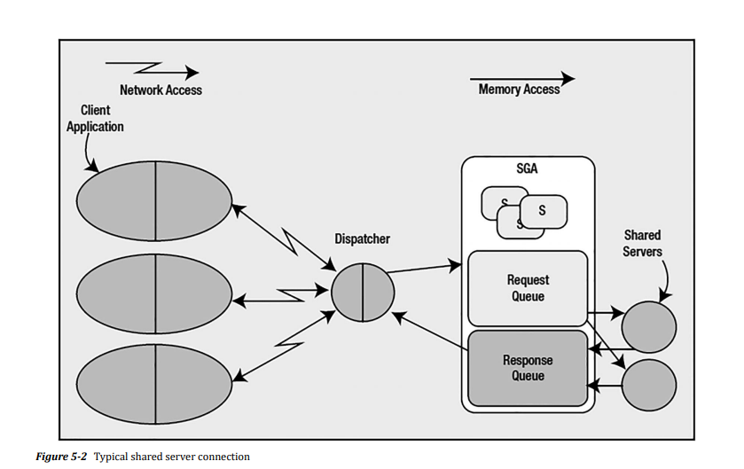

# Oracle Processes
Each process in Oracle will perform a particular task or set of tasks, and each will have internal memory (PGA memory) allocated by it to perform its job. An oracle instance has three board classes of processes
- *Server processes*: These perform work based on a client's request.
- *Background processes*: These are the processes that start up with the database and perform various maintenance tasks, such as writing blocks to disk, maintaining the online redo log, cleaning up aborted processes, maintaining Automatic Workload Repository (AWR), and so on.
- *Slave processes*: These are similar to background processes, but they are processes that perform extra work on behalf of either a background or a server process
  
## Server Processes
Two main connection types to Oracle
### Dedicated sercer
One to one mapping between a connection to the database and a server process or thread

This architecture provides two benifits:
- *Remote execution*: It is very natural for the client application to be executing on a machine other than the database itself
- *Address space isolation*: The server process has read-write access to the SGA. An errant pointer in a client process could easily corrupt data structures in the SGA if the client process and server process were
physically linked together
### Shared server 
A pool of server processes. Connecting to a database dispatcher.

### DRCP
DRCP is a mixture of dedicated server and shared server concepts. It inherits from a
shared server the concept of server process pooling, only the processes being pooled will be dedicated servers, not shared servers; it inherits from the dedicated server the concept of being dedicated.

In a shared server connection, the shared server process is shared among many sessions, and a single session will tend to use many shared servers. With DRCP, this is not true; the dedicated server process that is selected from the pool will become dedicated to the client process for the life of its session.
### Connection vs. Sessions
- Connection: A connection is a physical path from a client to an Oracle instance. It is established either over a network or over an IPC mechanism.
- Session: A session is a logical entity that exists in the instance.

A connection may have zero or more sessions. A session may or may not have a connnection.

### Dedicated Server vs. Shared Server vs. DRCP
#### When to use a Dedicated Server
Dedicated sercer is the only mode you should consider in a non-OLTP environment where you may have long-running transactions. A dedicated server is the recommended configuration for Oracle, and it scales rather nicely. As long as your server has sufficient hardware (CPU and RAM) to service the number of dedicated server processes your system needs, a dedicated server may be used for thousands of concurrent
connections.

#### When to use a Shared Server
A shared server is only appropriate for an OLTP system characterized by short, frequent transactions.

Potential benefits of a shared server
- Reduce the number of operating system processes/threads
- Aritficially limits the degree of cocurrency
- Reduces the memory needed on the system

#### DRCP
It is best suited for client applications that frequently connect, do some relatively short process, and disconnect—over and over and over again; in short, for client processes that have an API that do not have an efficient connection pool of their own.

## Background Processes
The background processes perform the mundane maintenance tasks needed to keep the database running. There are two classes of background processes: those that have a focused job to do and those that do a varity of other jobs(i.e., utility processes).
### Focused Background processes

#### PMON: the process monitor
This process is responsible for cleaning up after abnormally terminated connections. *PMON* is also responsible for monitoring the other Oracle background processes and restarting them if neccessary.
#### LREG: listener registration Process
The LREG process is responsible for registering instances and services with the Oracle TNS listener.
#### SMON: the system monitor
SMON is the process that gets to do all of the system-level jobs.SMON takes a system-level perspective of things and is a sort of garbage collector for the database.
- cleans up temporary space
- coaleces free space 合并空闲表空间
- Recovers transactions active against unavailable files
- Performs instance recovery of a failed node in RAC
- Cleans up OBJ\$: OBJ\$ is a low-level data dictionary table that contains an entry for almost every object
(table, index, trigger, view, and so on) in the database
- Manage undo segments
- Offlines rollback segments
#### RECO: distributed database recovery
RECO has a very focused job: it recovers transactions that are left in a prepared state because of a crash or loss of connection during a two-phase commit (2PC). A 2PC is a distributed protocol that allows for a modification that affects many disparate databases to be committed atomically.
#### CKPT: checkpoint process
CKPT assists with the checkpointing process by updating the file headers of the datafiles.
#### DBWn: Database Block Writer
The database block writer (DBWn) is the background process responsible for writing dirty blocks to disk.
#### LGWR: log writer
the lgwr process is responsible for flushing to disk the contents of the redo log buffer located in the SGA.
#### ARCn: Archive Process
the job of the ARCn process is to copy an online redo log file to another location when LGWR fills it up.
#### DIAG: diagnosability process
The DIAG process monitors the overall health of the instance, and it captures information needed in the processing of instance failures or process failures.
#### FDBA: flashback data archiver process
The flashback data archiver process is the key component of the flashback data archive capability—the ability to query data “as of” long periods of time ago
#### DBRM: database resource manager process
This process implements the resource plans that may be configured for a database instance.
#### GEN0: general task execution process
## Slave Process
### I/O Slaves
用于在不支持异步I/O的系统或设备上模拟异步I/O
### Pnnn: Parallel Query Execution Server
Parallel query is the capability to take a SQL statement such as a SELECT, CREATE TABLE, CREATE INDEX, UPDATE, and so on and create an execution plan that consists of many execution plans that can be done simultaneously
